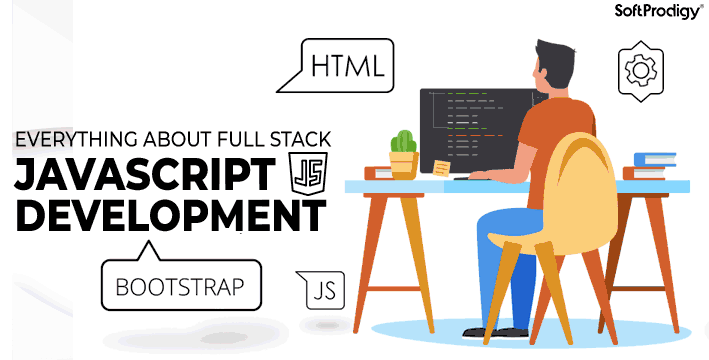

<h1 align="center">
  
  Senior Software Engineer
  
</h1>

  

  

## Core Skills

- 🔭 <b>Frontend</b> : React.js, Next.js, Vue.js, Nuxt.js, Angular
- 🔥 <b>BlockChain</b> : Web3.js, Ether.js, Ethereum, Solana, DeFi, Dex, NFT
- 🌱 <b>Libraries</b> : Bootstrap, TailwindCSS, Material UI, AntD, RSuite
- 🔭 <b>Mobile</b> : Android, React Native, Expo, Flutter
- 👨‍💻 <b>Backend</b> : PHP / Laravel, CI, Node.js / Express, Python / Django
- 💬 <b>Database</b> : MySQL, MongoDB, PostgreSQL, MariaDB, SQLite
- 📫 <b>Languages</b> : JavaScript, TypeScript, ReScript, HTML5, CSS/SCSS/LESS, PHP, Python, Solidity, Rust

    

## 
😇 Contact Me 😇

  
 
   
  &nbsp;&nbsp;
  
  &nbsp;&nbsp;
  
  &nbsp;&nbsp;
  

